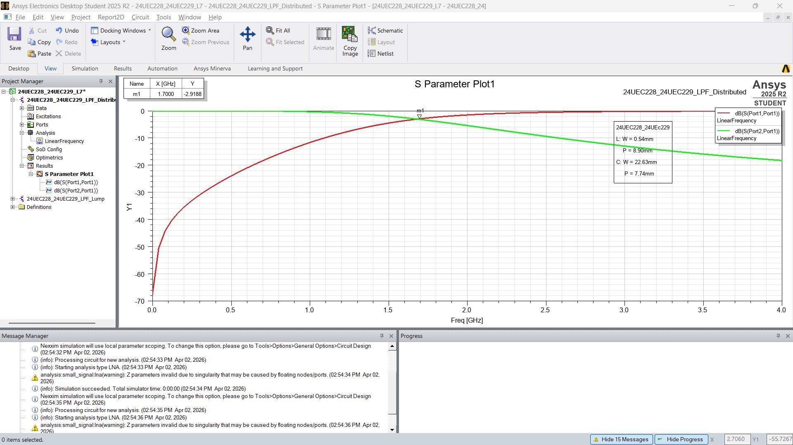
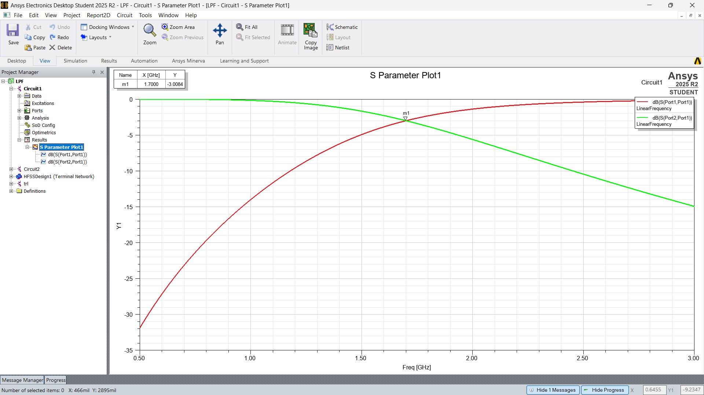
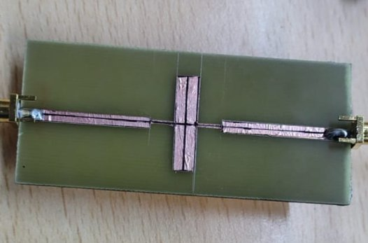
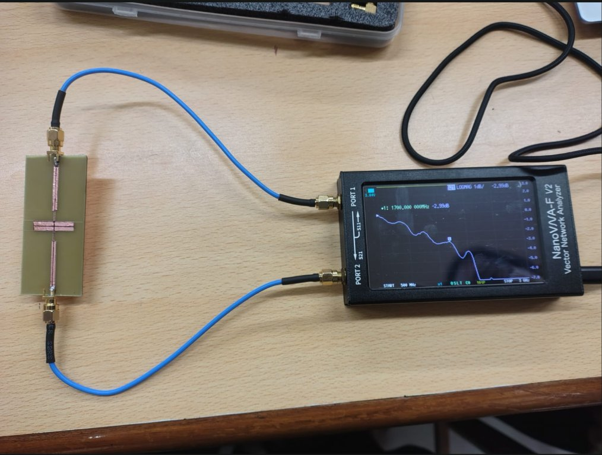
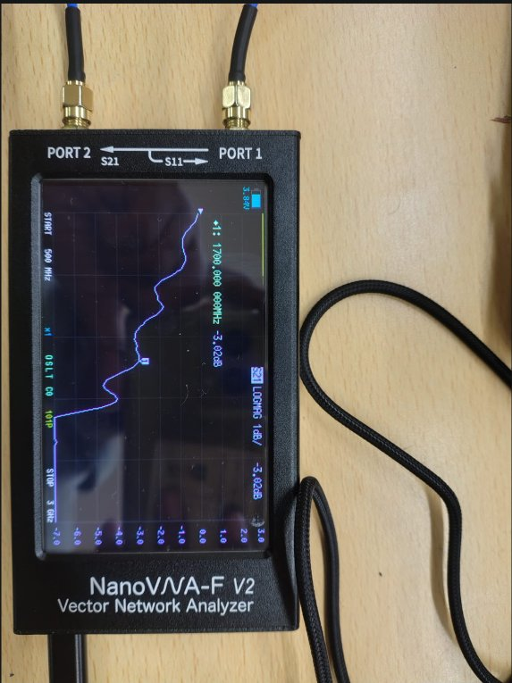
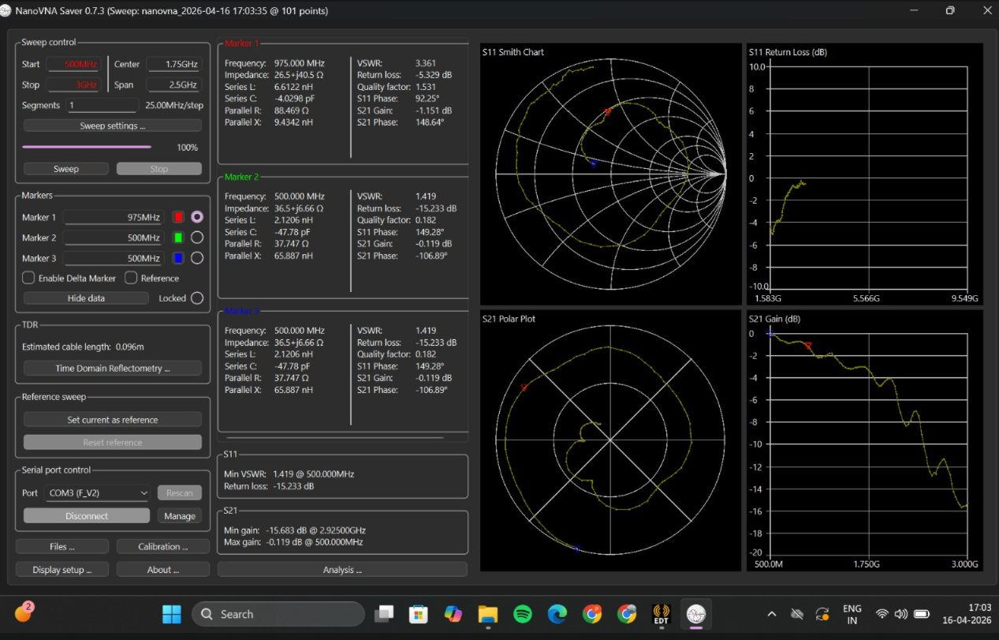

# 3rd-Order Microstrip Low-Pass Filter — 1.7 GHz

> **Full-stack RF design project** | Design → Simulation → Fabrication → Measurement  
> LNMIIT Jaipur · Microwave Engineering Lab · 2025–26

---

## Overview

This project documents the end-to-end design, simulation, physical fabrication, and VNA measurement of a **3rd-order stepped-impedance microstrip low-pass filter** with a cutoff frequency of **1.7 GHz**.

The design was carried out entirely from first principles — starting from normalized Butterworth prototype element values, converting through the insertion-loss method to lumped L/C elements, then realizing the filter physically as alternating high/low-impedance microstrip sections on an FR4 substrate. Results were validated across three simulation environments (lumped circuit, distributed circuit, and full-wave HFSS EM solver) and finally confirmed on a hand-fabricated PCB measured with a NanoVNA-F V2.

---

## Specifications

| Parameter | Value |
|---|---|
| Filter type | Low-Pass (Butterworth, N = 3) |
| Cutoff frequency (f_c) | **1.7 GHz** |
| Topology | Stepped-impedance microstrip |
| Substrate | FR4 (ε_r ≈ 4.4) |
| Characteristic impedance (Z₀) | 50 Ω |
| High-impedance line (Z_H) | 120 Ω |
| Low-impedance line (Z_L) | 10 Ω |
| Simulation tools | ANSYS Electronics Desktop (Circuit + HFSS) |
| Measurement instrument | NanoVNA-F V2 |
| Observed 3-dB point | **1.7 GHz** (matches design target) |

---

## Repository Structure

```
microstrip-lpf/
│
├── README.md                        ← You are here
│
├── docs/
│   ├── design_calculations.md       ← Step-by-step design derivation
│   └── design_notes.md              ← Substrate params, tool notes, lessons learned
│
├── simulation/
│   ├── lumped/
│   │   └── lumped_schematic.png     ← L-C prototype in ANSYS Circuit
│   ├── distributed/
│   │   └── distributed_schematic.png ← Microstrip stepped-impedance layout
│   └── hfss/
│       ├── hfss_3d_model.png        ← Full-wave EM model in HFSS
│       └── hfss_3d_model_full.png   ← Alternate view with airbox / ports
│
├── fabrication/
│   └── fabricated_filter.png        ← Hand-fabricated board (copper strip on FR4)
│
├── results/
│   ├── simulation/
│   │   ├── sparams_lumped.png       ← S11/S21 from lumped circuit sim
│   │   └── sparams_hfss.png         ← S11/S21 from HFSS full-wave sim
│   └── measurement/
│       ├── nanovna_setup.png        ← Hardware measurement setup
│       ├── nanovna_display.png      ← NanoVNA screen at 3-dB cutoff
│       └── nanovna_saver_full.png   ← NanoVNA Saver software — full parameter dump
│
└── scripts/
    └── lpf_design.py                ← Python script reproducing all design calculations
```

---

## Design Methodology

### Step 1 — Prototype Element Values (N = 3 Butterworth)

For a 3rd-order Butterworth low-pass prototype normalized to Z₀ = 1 Ω, ω_c = 1 rad/s:

```
g₁ = 1.0000   (series inductor L₁)
g₂ = 2.0000   (shunt capacitor C₂)
g₃ = 1.0000   (series inductor L₃)
g₄ = 1.0000   (termination)
```

### Step 2 — Frequency & Impedance Scaling

Scaling to f_c = 1.7 GHz and Z₀ = 50 Ω using the insertion-loss method:

```
Series inductor:   L = (g_i × Z₀) / ω_c
Shunt capacitor:   C = g_i / (Z₀ × ω_c)

ω_c = 2π × 1.7×10⁹ ≈ 1.068×10¹⁰ rad/s

L₁ = L₃ = (1.0 × 50) / (1.068×10¹⁰) ≈ 4.681 nH
C₂       = 2.0 / (50 × 1.068×10¹⁰)  ≈ 3.744 pF
```

These values were verified directly in the ANSYS lumped-element simulation (see `simulation/lumped/`).

### Step 3 — Distributed Element Conversion (Stepped Impedance)

High-impedance lines (Z_H = 120 Ω) realize the series inductors.  
Low-impedance lines (Z_L = 10 Ω) realize the shunt capacitor.

The electrical length β·l for each section is computed from:

```
For inductive sections (high-Z):  βl = arcsin(ω_c × L × Z_H⁻¹)   [degrees]
For capacitive sections (low-Z):  βl = arcsin(ω_c × C × Z_L)       [degrees]

βl_L (inductor) ≈ 23.87°   →  L: W = 0.54 mm,  P = 8.90 mm
βl_C (capacitor) ≈ 22.91°  →  C: W = 22.63 mm, P = 7.74 mm
50Ω feed lines              →     W = 3.05 mm,  P = 16.07 mm
```

Physical widths and lengths computed using the closed-form microstrip equations with substrate parameters: ε_r = 4.4, h = 1.6 mm, t = 0.035 mm.

---

## Simulation Results

### Lumped Element Circuit (ANSYS Circuit Simulator)

S₂₁ @ f_c = 1.7 GHz: **−3.009 dB** (design target: −3 dB ✓)



The lumped simulation confirms the topology and component values before committing to distributed realization.

### Distributed Microstrip Circuit (ANSYS Circuit — Stepped Impedance)

S₂₁ @ f_c = 1.7 GHz: **−2.919 dB** ≈ −3 dB ✓



Minor deviation from the lumped case is expected due to the stepped-impedance approximation's validity limit (βl < 45° per section, satisfied here).

### Full-Wave EM Simulation (ANSYS HFSS)

The physical geometry was imported into HFSS as a terminal-network design. Wave ports were assigned at the SMA feed points, and an interpolating frequency sweep was run from 0–4 GHz.

S₂₁ @ f_c = 1.7 GHz: **−3.008 dB** ✓  
S₁₁ in passband: **< −15 dB** (good impedance match)


---

## Fabrication

The filter was hand-fabricated using copper tape on an FR4 substrate with a pre-attached copper ground plane. SMA PCB connectors were soldered at both ports.

**Fabrication procedure:**
1. Paste copper strip uniformly on the substrate surface.
2. Mark and cut the stepped-impedance pattern using the calculated dimensions.
3. Solder SMA edge-mount connectors at both ends.
4. Verify DC continuity of the signal path and isolation from ground.



The characteristic cross-shaped footprint (wide low-Z shunt section crossing narrow high-Z series lines) is clearly visible.

---

## Measurement — NanoVNA-F V2

### Setup

The NanoVNA was calibrated using the standard OSL (Open-Short-Load) procedure on PORT 1 and a through on PORT 2. The sweep was set from 500 MHz to 3 GHz at 101 points.



### Results

| Parameter | Measured Value |
|---|---|
| 3-dB cutoff frequency (S₂₁) | **1.700 GHz** ✓ |
| S₂₁ @ 1.7 GHz | **−3.02 dB** |
| Min VSWR (S₁₁) | 1.419 @ 500 MHz |
| Return loss @ 500 MHz | −15.23 dB |
| Min S₂₁ gain | −15.68 dB @ 2.925 GHz |



The measured 3-dB point falls exactly at the design target of 1.7 GHz, validating the entire simulation-to-fabrication workflow. The NanoVNA Saver software plot shows the full S11/S21 sweep, Smith chart, and polar plot.



---

## Summary — Simulation vs Measurement Comparison

| Domain | S₂₁ @ 1.7 GHz | Notes |
|---|---|---|
| Lumped circuit (ANSYS) | −3.009 dB | Ideal LC, no substrate parasitics |
| Distributed circuit (ANSYS) | −2.919 dB | Stepped-impedance approximation |
| HFSS full-wave EM | −3.008 dB | Includes radiation, fringing, dielectric loss |
| **NanoVNA measurement** | **−3.02 dB** | Physical fabrication |

All four results converge to within 0.1 dB at the cutoff frequency, demonstrating excellent agreement from simulation to hardware.

---

## Tools & Technologies

- **ANSYS Electronics Desktop 2025 R2 Student** — Circuit simulator (lumped + distributed)
- **ANSYS HFSS 2025 R2 Student** — 3D full-wave EM solver (FEM)
- **NanoVNA-F V2** — Portable VNA for S-parameter measurement
- **NanoVNA Saver v0.7.3** — PC software for NanoVNA data capture and display
- **Python 3** — Design calculation script (`scripts/lpf_design.py`)

---

## How to Reproduce

### Simulation
1. Open ANSYS Electronics Desktop.
2. Import the lumped schematic: set L = 4.681 nH (×2) and C = 3.744 pF (×1).
3. For the distributed design, create microstrip TRL elements with the widths and lengths listed in the Design Methodology section.
4. For HFSS, build the geometry on an FR4 substrate (ε_r = 4.4, h = 1.6 mm), assign PEC ground, wave ports, and run an interpolating sweep from 0.1–4 GHz.

### Design Calculations (Python)
```bash
python scripts/lpf_design.py
```
Outputs all prototype values, scaled L/C values, electrical lengths, and physical microstrip dimensions.

---

## References

1. Pozar, D. M. *Microwave Engineering*, 4th ed. Wiley, 2012. (Chapters 8–9)
2. ANSYS HFSS User Guide, 2025 R2.
3. NanoVNA-F V2 User Manual.

---

## Author

**Shivansh Gupta** · 24UEC228  
Department of Electronics and Communication Engineering  
The LNM Institute of Information Technology, Jaipur  

